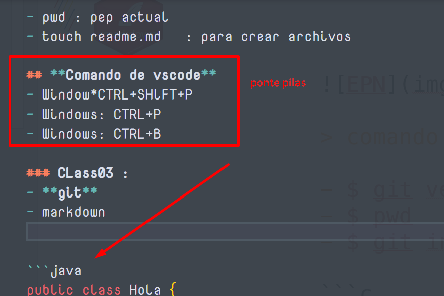

# Class01 : 30 de abrl
## Comando de linux
- pwd : pep actual
- pwd : pep actual
- pwd : pep actual
- 
- pwd : pep actual
- touch readme.md   : para crear archivos

## **Comando de vscode**
- Window*CTRL+SHlFT+P
- Windows: CTRL+P
- Windows: CTRL+B

### CLass03 :
- **git**
- markdown 


```java
public class Hola {
    public static void main(String[] args) {
        System.out.println();
    }
}
```

|Columna 1|Columna 2|
|--------|--------|
|    A    |    B    |
|    C    |    D   |

Link
[buscador ](http://google.com)


